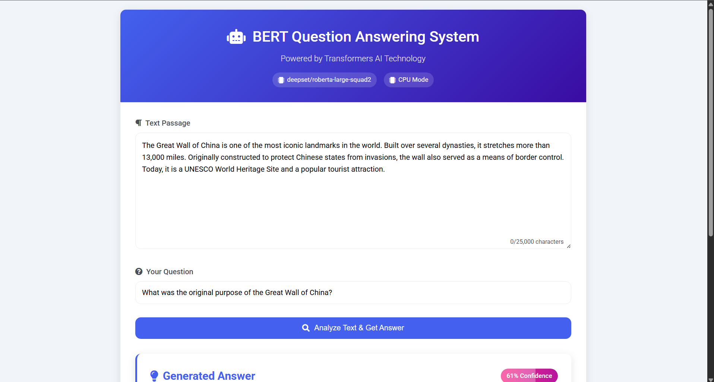
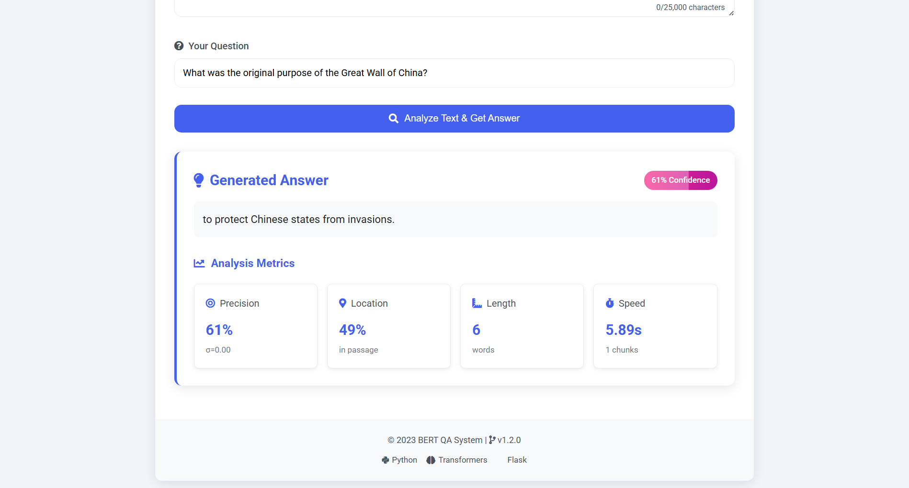

# BERT Question Answering System

This project is a web-based Question Answering (QA) system powered by the BERT model and Transformers AI technology. It allows users to input a text passage and ask questions about it, providing answers with confidence metrics and additional analysis.

## Features

- **BERT-based QA**: Uses the `deepset/roberta-large-squad2` model for question answering.
- **Semantic Similarity**: Leverages `sentence-transformers` for semantic similarity analysis.
- **Confidence Metrics**: Displays confidence scores, precision, and other metrics for the generated answers.
- **Chunked Passage Processing**: Handles large passages by chunking them for efficient processing.
- **Responsive UI**: A clean and responsive interface built with Flask and styled using CSS.

## Project Structure

```
.
├── app.py                 # Main Flask application
├── requirements.txt       # Python dependencies
├── static/
│   └── style.css          # CSS for styling the web interface
├── templates/
│   └── index.html         # HTML template for the web interface
└── README.md              # Project documentation
```

## Installation

1. Clone the repository:
   bash
   git clone https://github.com/jiya19g/Question-Answer-System-using-BERT.git
   cd Question-Answer-System-using-BERT   

2. Create a virtual environment and activate it:
   bash
   python -m venv venv
   source venv/bin/activate  # On Windows: venv\Scripts\activate
   

3. Install the required dependencies:
   bash
   pip install -r requirements.txt
   

## Usage

1. Run the Flask application:
   bash
   python app.py
   

2. Open your browser and navigate to:
   
   http://127.0.0.1:5000/
   

3. Enter a text passage and a question in the provided fields, then click "Analyze Text & Get Answer" to see the results.

## Configuration

- **Model**: The QA system uses the `deepset/roberta-large-squad2` model by default. You can change the model by modifying the `MODEL_NAME` variable in `app.py`.
- **Device**: The application automatically detects GPU availability and uses it if possible. Otherwise, it defaults to CPU mode.

## Dependencies

The project requires the following Python libraries, as listed in [requirements.txt](requirements.txt):
- Flask
- Torch
- Transformers
- Python-Dotenv
- Sentence-Transformers
- NumPy

## Screenshots

### Input section  


### Results section  


## License

This project is licensed under the MIT License. See the `LICENSE` file for details.

## Acknowledgments

- [Hugging Face Transformers](https://huggingface.co/transformers/)
- [Sentence Transformers](https://www.sbert.net/)
- [Flask Framework](https://flask.palletsprojects.com/)

## Contributing

Contributions are welcome! Feel free to open issues or submit pull requests.

---
© 2023 BERT QA System
